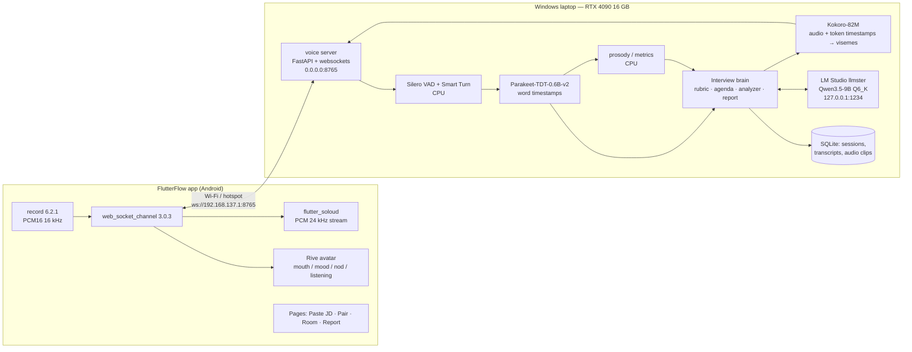

# Interview Cracker — Local-First Blueprint

**Project:** Enigma for Masai · **Prepared for:** Oikantik · **Date:** 5 September 2026
**Target hardware:** RTX 4090 Laptop GPU (16 GB VRAM), 32 GB DDR5, i9-13980HX, Windows 11
**UI:** FlutterFlow (Android first, iOS second) · **AI:** 100 % local on the laptop (LM Studio + a Python voice server)

This document is the synthesis of five research reports (in `research/`), ~860 tool calls across Hugging Face, official docs, GitHub, arXiv and product review sites, plus direct verification of every load-bearing number against Hugging Face file listings and the Open ASR Leaderboard CSV. Anything marked *(est.)* was computed or scaled, not measured on your laptop. Anything marked *(verify)* needs a five-minute check on your machine before you rely on it.

---

## 0. The one-page version

**Build "03 Interview Cracker".** Both briefs share the same engine (speech in → local LLM → speech out), but Interview Cracker's four judging criteria all land on things a 16 GB laptop does well today, its only "face" requirement can be solved with zero VRAM, and nothing in its brief fights your chosen architecture (phone UI + laptop brain). Speak It's third criterion — "the main loop still runs in airplane mode" on a phone — pushes you toward on-device inference, which is exactly the opposite of "local LLM in LM Studio/Ollama". It is winnable too, but it is a different product; Section 12 shows how 80 % of this blueprint carries over if you change your mind.

**The concept in one sentence:** *the interviewer is a puppet on the phone, the brain is on your laptop, and nothing ever leaves the room.*

**Six things no competitor does (this is the "unique way"):**

1. **Closed-door interview.** JD, voice and stumbles never leave the laptop. Every competitor found (Final Round AI at $148/mo, Yoodli, Huru, LockedIn, Big Interview, Scaler) is cloud + subscription; none runs offline. For a fresher, "free after the hardware you already own" and "my fumbles are not on someone's server" are real features.
2. **JD provenance you can tap.** Every question carries a *why-trace* pointing at a verbatim sentence in the pasted JD, validated in code as a substring — so the "swap the JD, watch the questions change" demo proves criterion 1 in 60 seconds. No product found exposes this.
3. **Puppet + Brain.** The on-screen interviewer is a Rive character rendered on the phone, lip-synced from Kokoro's token timestamps and reacting (listening, nodding, thinking, unimpressed) to what the answer analyzer decides. It costs ~0 VRAM and survives a weak hotspot because only tiny JSON events and 24 kHz audio cross the wire. Only micro1's "Zara" combines an avatar with adaptive branching — and that is a proctored hiring gate, not a practice tool.
4. **Coverage-driven pressure.** A SparkMe-style *Agenda Manager* keeps a competency × evidence matrix from the JD and always asks the question that closes the biggest gap: one question at a time, follow-ups triggered by vagueness ("we used caching and stuff"), a countdown, and an interviewer who can say "let me stop you there". A user-set pressure dial (Warm-up / Realistic / Tough) keeps it from humiliating beginners — the anxiety literature says that matters (interview anxiety ↔ performance r = −.19).
5. **Evidence-locked report.** The final report can only cite quotes that string-match the transcript with timestamps; tap a quote to hear yourself say it. Unreferenced criticism is dropped by code, not by prompt — the antidote to LLM over-validation (6–71 % of wrong answers get validated in the May-2026 NC State study).
6. **Indian-English-first STT, chosen by benchmark, not by habit.** Since 28 Aug 2026 the Open ASR Leaderboard carries a Voice Arena Monsoon en-IN column (2,102 conversational clips, 1,444 speakers, 428 districts). On it, the 0.6B `nvidia/parakeet-tdt-0.6b-v2` scores **3.89 % WER — better than Microsoft's June-2026 Azure Speech (4.40 %)**. Local beats cloud on your users' accent.

**The stack in one line:** FlutterFlow app (`record` → WebSocket → `flutter_soloud` + Rive avatar) ↔ Python voice server on the laptop (Silero VAD + Smart Turn v3.1 + Parakeet-TDT-0.6B-v2 + Kokoro-82M + prosody) ↔ LM Studio serving **Qwen3.5-9B Q6_K** (7.46 GB, thinking off, MTP speculative decoding). Budget: ~11.5 GB VRAM used, ~4.5 GB free. End-of-answer → interviewer starts speaking: ~1.1–1.6 s *(est.)*, masked by the avatar's "thinking" beat.

---

## 1. Why Interview Cracker, criterion by criterion

| Judging criterion | Interview Cracker with this stack | Speak It with this stack |
|---|---|---|
| **1.** Questions clearly from the JD / Finish one loop out loud | JD → validated competency rubric → agenda manager → why-trace on every question. Provable with the swap-the-JD demo. **Low risk.** | Speak → STT → correction JSON → TTS → forced retry. Also low risk; the loop itself is easy. |
| **2.** A person in front of them / Correct, don't praise | Rive puppet on the phone, lip-synced + reactive; ~0 VRAM. **Medium build effort, high demo payoff.** | "The word they said badly" needs pronunciation scoring. Research shows phoneme-level judgement is still ~0.3–0.4 correlation with humans for *every* method; word-level ~0.6. Doable but scientifically soft, and judges will compare you to ELSA/Stimuler. |
| **3.** Pressure / Works in airplane mode | Timer, no back/skip, follow-ups, barge-in — all server logic. **Low risk.** | Phone in airplane mode → either on-device models (sherpa-onnx + Gemma 4 E2B 2.6 GB on the phone, unproven quality, heavy FlutterFlow native work) or "airplane mode + Wi-Fi to laptop hotspot", which judges may read as a dodge. **This is the criterion that fights your architecture.** |
| **4.** Real result at the end / Simple for a beginner | Evidence-locked report with quotes, timestamps, replay, STAR strip, coverage matrix. **Low risk.** | Simple UI is easy; the hard part is above. |
| Market gap | Nobody local, nobody with avatar + adaptive + JD-grounded + quote-level feedback. **Empty square.** | Crowded (ELSA 10M+ installs, Stimuler 4.8★/1 Cr+ installs in India, BoldVoice, Praktika, Speak). Gap exists (offline + grammar + forced retry + L1-aware) but you are fighting incumbents. |
| Fit with Masai's audience | Placement interviews are the #1 scenario freshers care about; the Speak It brief itself lists "students before placements, job seekers before interviews". | Same audience, broader problem. |

**Verdict:** Interview Cracker is the higher-ceiling, lower-risk build on your hardware and your UI choice. It also *contains* the most valuable Speak It scenario (the HR round), so a later "English-practice mode" is a natural v2.

---

## 2. The unique approach, in detail

### 2.1 Puppet + Brain

Every "AI interviewer" product either streams video from a GPU farm (HeyGen/D-ID: "sub-200 ms" on Azure clusters, $40k/yr enterprise) or shows nothing at all. On a 16 GB laptop that already holds a 7.5 GB LLM, a neural talking head (Ditto, MuseTalk, SoulX-FlashHead) does not fit, and streaming video to a phone over a hotspot is fragile.

So the face lives on the phone. A Rive state machine has four inputs — `mouth` (number 0–9), `mood` (number: neutral / interested / thinking / unimpressed), `listening` (bool), `nod` (trigger). The laptop sends, alongside each chunk of TTS audio, a viseme track derived from Kokoro's per-token timestamps, and a `reaction` event after each answer is analysed. The phone plays audio, reads the playback clock, and drives `mouth`. Wire cost: a few hundred bytes per second of JSON plus 16-bit 24 kHz audio. VRAM cost: zero. This is the same trick Adobe Character Animator and every 2D VTuber pipeline uses; nobody has put it in an interview app.

### 2.2 JD provenance (criterion 1, made falsifiable)

Stage A of the brain asks the LLM for a competency rubric where every competency must carry the *verbatim* JD sentence that justifies it. The server rejects any competency whose quote is not a literal substring of the pasted JD and re-asks. Every question then inherits a `why` block: competency, JD quote, difficulty rung, strategy, and (for follow-ups) the candidate quote + timestamp that triggered it. In the app, tapping the question card flips it to show the JD with that sentence highlighted. In the demo, you paste two JDs with the same title and show the questions diverge.

### 2.3 Agenda Manager (the "pressure" is systematic, not random)

Borrowed from SparkMe (SALT-NLP, Feb 2026: an Agenda Manager tracking "subtopic coverage" gave +4.7 % guide coverage with fewer turns). The server keeps a matrix of competency × expected-evidence × {none, weak, strong}. Policy: ask about the must-have with the least evidence; alternate behavioural/technical per the JD mix; escalate one rung (recall → applied example → trade-off/failure → design under constraint) after a strong answer; follow up when the analyzer flags an answer as vague, generic ("we" without "I"), or missing a result. One question on screen, no back, no skip, no preview, a countdown per question.

### 2.4 Pressure dial (so it does not humiliate a fresher)

Powell, Stanley & Brown (2018 meta-analysis): interview anxiety correlates with performance at r = −.19; MIT's MACH coach (nodding, mirroring, post-hoc feedback) improved expert-rated performance in a 90-student trial; a VR job-interview RCT improved live role-play performance (p = 0.046). So: Warm-up (no timer, no interruptions, "thinking" face only), Realistic (timer, one follow-up per gap), Tough (interruptions on time-out or looping, "unimpressed" state after a second vague answer to the same probe). Reactions always target the answer, never the person.

### 2.5 Evidence-locked report (criterion 4, hallucination-safe)

Stage C returns JSON in which every judgement — STAR components, hedges, specificity gaps, contradictions — carries a `quote` and `[t_start, t_end]`. The server fuzzy-matches each quote against the transcript (RapidFuzz ratio ≥ 0.9) and drops anything that fails. The report generator sees only validated JSON. The report screen shows: the three most fixable behaviours, each with a quote you can tap to replay your own audio; a per-answer STAR strip; the coverage matrix with empty must-have rows explaining the score; delivery metrics (WPM, pauses, fillers, hedges, JD-keyword coverage, monotone flag); and "what a strong answer to Q3 would have included".

### 2.6 Local-first as a feature, not a constraint

Three concrete arguments for the demo: (a) privacy — "your JD and your answers never leave this laptop"; (b) accent — Svarah (AI4Bharat, 2023) measured Whisper-large at 7.2 % WER on Indian English versus Google 20.7 % / Azure 21.3 %, and in September 2026 a local 0.6B Parakeet beats Azure's newest cloud model on the Monsoon en-IN set; (c) price — ₹0 per interview versus $148/month.

### 2.7 Stretch: Hinglish rescue

If the candidate freezes and switches to Hindi, `nvidia/nemotron-3.5-asr-streaming-0.6b` (`target_lang=auto`, hi-IN + en-IN in one streaming model) can still transcribe; the interviewer notes it in the report ("you switched to Hindi at 1:12 — in a real round, try: …"). This is the bridge to a future Speak It mode. Not for v1.

---

## 3. Model picks (Hugging Face MCP-verified)

| Role | Pick | Size / VRAM | License | Why this one | Fallback |
|---|---|---|---|---|---|
| **LLM** | `unsloth/Qwen3.5-9B-GGUF` → `Qwen3.5-9B-Q6_K.gguf` | **7,458,301,152 B = 7.46 GB** (verified); UD-Q4_K_XL 5.97 GB | Apache-2.0 | Best instruction-following and tool/JSON in class (IFEval 91.5, TAU2 79.1, BFCL-V4 66.1); 201 languages incl. Hindi; hybrid Gated-DeltaNet → KV cache only ~0.3 GB at 8K; trained with an MTP head for speculative decoding; 262,144 ctx. Newer Qwen 3.6/3.7/3.8 have no sub-27B release, so this is still the newest small dense Qwen. | `google/gemma-4-12B-it-qat-q4_0-gguf` → **6,975,879,296 B = 6.98 GB** (verified), Apache-2.0; humans prefer its conversational tone in Arena tests, slightly weaker tool-calling (Tau2 69.0). |
| **LLM runtime** | LM Studio 0.4.23 (headless `llmster`) | — | free for personal use *(verify commercial terms)* | Stable MTP speculative decoding on CUDA, per-model KV-quant/context/parallel settings, grammar-constrained JSON schema, text-only GGUF load (skips the 0.9 GB vision projector), OpenAI-compatible API on 127.0.0.1. | Ollama v0.33.3 (`ollama pull hf.co/unsloth/Qwen3.5-9B-GGUF:Q6_K`, `"think": false`, `"format": <schema>`). |
| **STT (per answer)** | `nvidia/parakeet-tdt-0.6b-v2` | ~1.2–1.5 GB *(est.)* | CC-BY-4.0 | **en-IN WER 3.89** (Open ASR Leaderboard, Monsoon column; Azure 06-2026 = 4.40, AssemblyAI = 3.49); avg 4.70; RTFx 6,025 (a 90-second answer transcribes in well under a second); native word-level timestamps. English only — fine for v1. | `faster-whisper` `large-v3` int8 (en-IN 3.95, ~2.9 GB, `word_timestamps=True`) — the most battle-tested Windows path; or `Qwen/Qwen3-ASR-1.7B-hf` (en-IN 3.50, Hindi 12.25, Apache-2.0, ~2.7 GB Q8) when you want Hinglish. |
| **STT (live captions / barge-in, v2)** | `nvidia/nemotron-speech-streaming-en-0.6b` | ~1.2–2.0 GB *(est.)* | NVIDIA Open Model License | Cache-aware streaming, 80–1,120 ms chunks, en-IN 4.45, emits `word_time_offsets`. Runs on Windows via `transformers>=5.13` (`AutoModelForRNNT`) or parakeet.cpp's Windows CUDA build. | Skip streaming in v1; Silero VAD gives you the "listening" state for free. |
| **TTS** | `hexgrad/Kokoro-82M` (`kokoro` 0.9.4 + espeak-ng MSI) | ~0.5 GB GPU or CPU | Apache-2.0 | 36–96× real-time; 40 ms to first audio; returns per-token `start_ts/end_ts` for English voices (`lang_code='a'/'b'`) → free lip-sync data. Voices: `af_heart`, `bm_george`, `am_michael` etc. | `ResembleAI/chatterbox-turbo` (MIT, ~3–5 GB *(unverified)*) cloned from a licensed Indian-English reference clip for an Indian-accented interviewer; `ai4bharat/indic-parler-tts` (Apache-2.0, non-streaming). Both lose Kokoro's timestamps → use the RMS mouth fallback (§6.3). |
| **VAD** | `snakers4/silero-vad` v6.2 (ONNX, CPU) | 0 GPU | MIT | 260 K params, RTF 0.013. | TEN VAD (faster speech→silence). |
| **End-of-turn** | `pipecat-ai/smart-turn` v3.1 (int8 ONNX, CPU) | 0 GPU | BSD-2 | 8 MB, 12–57 ms on CPU, 94.7 % English accuracy, 23 languages incl. Hindi; stops the interviewer jumping in on a thinking pause. | A plain 700 ms silence timer for v1. |
| **Fillers ("um/uh") — optional** | `faster-whisper` large-v3-turbo int8 second pass with a disfluent `initial_prompt` | ~0.9 GB | MIT | Whisper/Parakeet drop fillers; prompting Whisper with "Umm, let me think like, hmm…" is the standard trick to keep them. | `nyralabs/CrisperWhisper` (best verbatim model; **CC-BY-NC** — hackathon only). |
| **Prosody** | `praat-parselmouth` or `librosa.pyin` (CPU) | 0 GPU | GPL / ISC | F0 SD and range, RMS variance → "monotone" flag relative to the user's own baseline. | — |
| **Quote validation** | `rapidfuzz` | 0 | MIT | Fuzzy ratio ≥ 0.9 on normalised text; the gate behind every report line. | — |

### 3.1 VRAM budget (8K context, one parallel slot)

| Component | VRAM | Basis |
|---|---|---|
| Qwen3.5-9B Q6_K weights | 7.46 GB | verified file size |
| KV cache @ 8,192 tokens (f16) + DeltaNet state | ~0.32 GB | from `config.json` (8 attention layers × 4 KV heads × 256 dim); q8_0 KV halves it |
| llama.cpp compute buffers + CUDA context | ~0.8 GB | typical *(est.)* |
| Parakeet-TDT-0.6B-v2 (fp16) + CUDA context | ~1.5 + 0.3 GB | *(est.)* — measure on day 1 |
| Kokoro-82M fp16 | ~0.5 GB | *(est.)*; can run on CPU |
| Windows desktop / WDDM reserve | ~0.5–1.0 GB | rule of thumb |
| **Total** | **≈ 11.1–11.9 GB → ≈ 4 GB free** | enough for the optional Whisper filler pass (0.9 GB) or Qwen3-ASR-1.7B Q8 (2.7 GB) |

Run every GPU speech model in **one** Python process (each extra CUDA process costs 300–500 MB of context). Set NVIDIA Control Panel → *CUDA – Sysmem Fallback Policy* → **Prefer No Sysmem Fallback** for `python.exe` and LM Studio so an overflow fails loudly instead of silently spilling to system RAM at 10× slowdown.

### 3.2 Latency budget (end of candidate's answer → interviewer starts speaking)

| Stage | Time *(est.)* |
|---|---|
| VAD silence + Smart Turn decision | 250–350 ms |
| Parakeet transcription of a 60–90 s answer (RTFx in the hundreds on a laptop 4090) | 100–300 ms |
| Stage C answer analysis (JSON, ~150 output tokens) — runs **in parallel** with the next question | 0 ms on the critical path if you pre-plan the next question (§5.3) |
| Stage B next question (~40 tokens) — prefill ~2 K tokens + decode at 40–55 tok/s, MTP on | 500–900 ms |
| Kokoro first sentence | 80–150 ms |
| Wi-Fi + phone buffer | 50–100 ms |
| **Total** | **≈ 1.0–1.8 s** — cover it with the avatar's "thinking / writing a note" beat, which is what a real interviewer does anyway |

Laptop tok/s is scaled from desktop-4090 measurements by memory bandwidth (576 vs 1,008 GB/s); nobody has published numbers for these exact models on a 4090 Laptop — measure on day 1 and adjust context/quant if needed.

---

## 4. Architecture



**Trust boundary:** only the Python server is exposed on the LAN (with a per-session token from the QR code). LM Studio stays bound to 127.0.0.1.

### 4.1 Wire protocol (one WebSocket per session, `ws://<laptop-ip>:8765/ws`)

Client → server: `{"type":"hello","token":"<from QR>","mode":"interview","in":{"fmt":"pcm16","sr":16000,"ch":1},"out":{"fmt":"pcm16","sr":24000}}`; then binary frames of 20 ms PCM16 mono @ 16 kHz (640 bytes each — the same framing Pipecat documents); optional `{"type":"ptt","state":"down"|"up"}`, `{"type":"cancel"}`, `{"type":"ping"}`.

Server → client: `{"type":"ready","session":"…"}` · `{"type":"vad","state":"speech_start"|"speech_end"}` (drives `listening`) · `{"type":"stt","text":"…","final":true}` · `{"type":"question","id":"Q4","text":"…","why":{…},"time_limit_s":90}` · `{"type":"reaction","mood":"interested"|"neutral"|"thinking"|"unimpressed","nod":true}` · `{"type":"tts_start","sr":24000}` + binary PCM frames + `{"type":"viseme","t_ms":…,"id":0-9}` interleaved (WebSocket ordering is guaranteed) + `{"type":"tts_end"}` · `{"type":"interrupt"}` (barge-in: the phone calls `SoLoud.stop()` and flushes) · `{"type":"report","url":"http://<ip>:8765/report/<session>.json"}`.

The client schedules viseme events against the audio playback clock (`getStreamTimeConsumed()`), not wall time.

### 4.2 Session state machine

`LOBBY` (paste JD, pick pressure dial, pick interviewer voice) → `PAIR` (scan QR, `hello`/`ready`) → `PREP` (server runs Stage A, pre-generates the opener and Q1 audio while the candidate reads a 20-second "how this works" screen) → `ROUND` (loop: `ASKING` → `LISTENING` → `ANALYSING` ∥ `PLANNING` → `ASKING` …; `INTERRUPT` allowed in Tough) → `WRAP` (Stage D report) → `REPORT` (tap-to-replay, coverage matrix, retry-the-weakest-question).

---

## 5. The interview brain

All LLM calls go through LM Studio's OpenAI-compatible endpoint with `response_format: {type: "json_schema", …}` (grammar-constrained decoding, so the JSON always parses), thinking **off**, temperature 0.2–0.3 for analysis and 0.6–0.7 for question wording. Pass the coverage matrix + the last two turns, not the whole chat: multi-turn drift ("LLMs Get Lost in Multi-Turn Conversation", May 2025) is real for small models.

### 5.1 Stage A — JD → rubric with provenance

Prompt sketch: *"You are the lead of a hiring panel. Read the job description. Extract 5–8 competencies. For each, copy the exact sentence(s) from the JD that justify it — verbatim, no paraphrase. Do not invent competencies that are not in the text. Mark must-have vs nice-to-have, technical vs behavioural, and list 2–4 kinds of evidence a strong candidate would give. Return JSON only."*

```json
{
  "role_title": "Backend Developer (Node.js)",
  "seniority": "fresher|junior|mid|senior",
  "behavioral_technical_mix": {"behavioral": 0.4, "technical": 0.6},
  "competencies": [
    {
      "id": "C1", "name": "REST API design in Node.js", "type": "technical", "priority": "must_have",
      "jd_quotes": [{"text": "Build and maintain RESTful services in Node.js", "start": 412, "end": 458}],
      "evidence_expected": ["designed endpoints", "handled auth or versioning", "measured latency"],
      "difficulty_ladder": ["recall", "applied example", "trade-off or failure", "design under constraint"]
    }
  ]
}
```

The gate that makes criterion 1 provable:

```python
import re
def validate_rubric(jd: str, rubric: dict) -> tuple[dict, list[str]]:
    norm = lambda s: re.sub(r"\s+", " ", s).strip().lower()
    jd_n, rejected = norm(jd), []
    for c in list(rubric["competencies"]):
        ok = [q for q in c["jd_quotes"] if norm(q["text"]) in jd_n]
        if not ok:
            rejected.append(c["id"]); rubric["competencies"].remove(c)   # re-ask for these
        else:
            c["jd_quotes"] = ok
    return rubric, rejected
```

If more than two competencies are rejected, re-run Stage A once with the rejected names listed as "these were not grounded — quote the JD literally or drop them".

### 5.2 Stage B — Agenda Manager → next question with a why-trace

State: `coverage[competency_id][evidence_item] ∈ {none, weak, strong}`, `asked_count[competency_id]`, `ladder_pos[competency_id]`, `mix_debt` (behavioural vs technical balance). Policy in order: (1) if the last answer's `next_strategy` is a follow-up, ask it (max two follow-ups per competency); (2) else pick the must-have with the most `none` cells, respecting `mix_debt`; (3) escalate `ladder_pos` after a `strong`; (4) stop after N questions (6 Warm-up / 8 Realistic / 10 Tough) or when every must-have has at least one `strong`.

```json
{
  "question_id": "Q4",
  "text": "You mentioned caching. What exactly did you cache, and how did you decide the TTL?",
  "why": {
    "competency_id": "C3", "jd_quote": "optimise API latency", "ladder_rung": "trade-off or failure",
    "strategy": "dig_deeper_vague",
    "triggered_by": {"answer_id": "A3", "quote": "we used caching and stuff", "t": [8.2, 11.9]}
  },
  "time_limit_s": 90,
  "reaction_before": "interested"
}
```

`strategy ∈ {open_probe, evidence_probe, dig_deeper_vague, dig_deeper_generic, quantify_result, ownership_probe, contradiction_probe, escalate}`. Follow-up triggers: vague (no concrete noun, number or name) → "Give me one specific instance"; generic "we" → "What was *your* part?"; no Result → "What changed because of it — any number?"; JD keyword claimed without detail → "Walk me through how you did X".

### 5.3 Stage C — Answer analysis (transcript + timestamps in, validated JSON out)

Input: verbatim transcript with word timestamps, the target competency, the question's `why`. Output:

```json
{
  "answer_id": "A3",
  "star": {
    "situation": {"present": true, "quote": "in my final-year project", "t": [0.4, 1.9]},
    "task": {"present": false},
    "action": {"present": true, "quote": "we used caching and stuff", "t": [8.2, 11.9], "ownership": "we"},
    "result": {"present": false}
  },
  "specificity": {"score": 1, "scale": "0-3", "missing": ["named technology", "number", "time frame"]},
  "jd_keyword_coverage": {"hit": ["caching"], "missed": ["latency", "TTL", "Redis"]},
  "hedges": [{"quote": "I think maybe", "t": [5.1, 5.8]}],
  "contradictions": [],
  "verdict": "vague|generic|adequate|strong",
  "evidence_updates": {"C3": {"measured latency": "none", "designed endpoints": "weak"}},
  "next_strategy": "dig_deeper_vague",
  "reaction": "neutral"
}
```

Post-validation: every `quote` must fuzzy-match a span of the transcript (RapidFuzz `partial_ratio` ≥ 90 on normalised text) and its `t` must fall inside the matched words' timestamps; otherwise the field is nulled. Cheap rules on top of the LLM: a Result needs a past-tense outcome verb or a number; ownership = first-person-singular ratio; `we`-ratio > 0.7 flags team-hiding (heuristic, tune it).

**Critical-path trick:** run Stage C for answer *n* and Stage B for question *n+1* concurrently. Stage B uses the coverage matrix as of answer *n−1* plus a lightweight "vagueness" heuristic on the raw transcript; if Stage C then returns a follow-up strategy, the server swaps in the follow-up before TTS starts. The candidate never waits for analysis.

### 5.4 Delivery metrics (computed from timestamps + audio, no LLM)

WPM over speaking time (pauses > 0.5 s excluded), reported against a 130–170 conversational band (common guidance, not literature); pauses > 1.0 s (count, longest) and latency to first word; fillers per minute (from the optional Whisper verbatim pass); hedges with timestamps; answer length vs `time_limit_s`; JD keyword coverage; F0 standard deviation and RMS variance vs the candidate's own baseline from Q1 → "monotone" flag. Skip webcam eye contact in v1 — Yoodli's own users say it "requires optimal conditions".

### 5.5 Stage D — Report

Generator sees only validated Stage C JSON + metrics + coverage matrix. Output schema: `top_fixes[3]` (each: behaviour, `answer_id`, quote, `t`, rubric line, why it matters, "stronger version"), `per_question[]` (STAR strip, verdict, key quote), `coverage_matrix`, `delivery`, `overall_band` (not a score out of ten — a band plus the one thing that would move it). Any bullet whose `answer_id`/quote pair is not in the validated set is dropped by code.

### 5.6 Pressure dial

| Dial | Timer | Follow-ups | Interruptions | Avatar states |
|---|---|---|---|---|
| Warm-up | none | 1 per competency | never | listening, thinking, nod |
| Realistic | 90 s behavioural / 60 s technical | up to 2 | on time-out only | + interested / neutral |
| Tough | same, visible countdown | up to 2, plus contradiction probes | on time-out **and** on looping (repeated n-grams) | + unimpressed after a second vague answer to the same probe |

---

## 6. The interviewer on screen (Rive puppet)

### 6.1 State machine spec (author in the Rive editor, free tier)

Artboard `Interviewer` (front-facing, shoulders-up, stylised — not photoreal, which keeps it out of the uncanny valley and off the GPU). Inputs: `mouth` number 0–9; `mood` number 0 neutral / 1 interested / 2 thinking / 3 unimpressed; `listening` bool; `nod` trigger; `blink` handled by an idle timeline. Layers: `Idle` (breathing, blink), `Mouth` (blend by `mouth`, instant transitions — no easing between visemes), `Mood` (brow/eyes/head tilt), `Nod` (one-shot). Ten mouth shapes, grouped Character-Animator style: 0 rest/closed · 1 M/B/P · 2 F/V · 3 TH · 4 L · 5 D/T/N/S/Z (teeth) · 6 R · 7 Ah (open) · 8 Ee (wide) · 9 Oh/Oo (round).

A ready-made starting point exists on the Rive Marketplace ("Custom Talking Avatar: Real-Time Lip Sync for Your App", stvfunm, Jun 2025, CC-BY) — open it, check its input names, and add the mood/nod layers. GraphicMama's free Character Animator mouth sets are another asset source *(check their terms)*.

### 6.2 Viseme track from Kokoro (English voices)

`KPipeline` results expose `tokens[i].text`, `.phonemes` (misaki IPA) and `.start_ts/.end_ts` for `lang_code` `'a'` or `'b'`. Split each token's duration evenly across its phonemes, map each phoneme to one of the ten mouths, and emit `{t_ms, id}` at ≥ 25 events/s:

```python
# Sketch — tune the phoneme→mouth map by ear against your Rive shapes.
VISEME = {**dict.fromkeys("mbp", 1), **dict.fromkeys("fv", 2), "θ": 3, "ð": 3, "l": 4,
          **dict.fromkeys("tdnszʃʒʧʤ", 5), "ɹ": 6, "r": 6,
          **dict.fromkeys("ɑaæʌ", 7), **dict.fromkeys("iɪeɛ", 8), **dict.fromkeys("oʊuʊɔ", 9)}
def visemes_from_tokens(tokens):
    out = []
    for tk in tokens:
        if tk.start_ts is None or not tk.phonemes: continue
        ph = [p for p in tk.phonemes if p.isalpha() or p in "θðʃʒʧʤɹɑæʌɪɛʊɔ"]
        step = (tk.end_ts - tk.start_ts) / max(len(ph), 1)
        for i, p in enumerate(ph):
            out.append({"t_ms": int((tk.start_ts + i * step) * 1000), "id": VISEME.get(p, 7 if p in "aeiou" else 5)})
        out.append({"t_ms": int(tk.end_ts * 1000), "id": 0})
    return out
```

### 6.3 Fallback for any other TTS: RMS mouth-open

If you switch to Chatterbox-Turbo (Indian-accented voice) or Kokoro's Hindi voices (no timestamps), compute RMS energy per 40 ms window of the PCM you are about to send and emit `{"type":"mouth","open":0..1}`; map `open` to a blend of mouths 0/7/8. It looks 80 % as good and costs nothing. Rhubarb Lip Sync (MIT CLI) is the batch upgrade for pre-generated clips.

### 6.4 Reactions

`vad speech_start` → `listening=true`; every ~6–9 s of candidate speech → `nod` (randomised, only in Warm-up/Realistic); `speech_end` → `mood=thinking` until `tts_start`; Stage C `reaction` → `mood` for the duration of the next question; `interrupt` → `mood=neutral` + a short "raise hand" timeline if you draw one.

### 6.5 FlutterFlow specifics for the avatar

FlutterFlow's built-in Rive widget plays timelines but **does not expose state-machine inputs**, so the avatar is a **Custom Widget** using `rive` 0.14.11 (`rive_native` 0.1.11; `await RiveNative.init()` once; `controller.stateMachine.number('mouth').value = id`). Only one `rive` version can exist in the pubspec — either match the version FlutterFlow pins or remove every built-in Rive widget from the project *(read the exported `pubspec.yaml` to see the pinned version)*. The widget subscribes directly to the voice-link event stream for 25–50 Hz mouth updates; never route those through App State (every `FFAppState().update()` rebuilds listeners).

---

## 7. FlutterFlow app plan

### 7.1 Pages

1. **Paste JD** — multiline field, pressure dial (3 chips), interviewer voice (2–3 chips), "Start" → `PAIR` if not paired.
2. **Pair** — `mobile_scanner` QR view + manual `ip:port:token` entry; status pill (grey → green on `ready`).
3. **Prep** — 20-second "how this works" screen with three lines (one question at a time · no going back · speak, don't type) while the server runs Stage A and pre-renders Q1 audio. Show the rubric's competency chips *without* the questions (transparency without preview).
4. **Room** — avatar (top 45 %), question card (tap to flip to the why-trace: JD with the sentence highlighted), countdown ring, live "I'm listening" caption, big mic state (auto by VAD; optional push-to-talk). No back button, no skip.
5. **Report** — top-3 fixes with tap-to-replay quotes, per-question STAR strip, coverage matrix, delivery metrics, "retry weakest question" (returns to Room for one question, appends to the report).
6. **History** — past sessions (local JSON from the server, cached in the app).

### 7.2 Custom code (all inside FlutterFlow)

Code File `VoiceLink` (singleton): owns `WebSocketChannel`, `AudioRecorder` (`record`), `SoLoud` buffer stream, and a broadcast `Stream<VoiceEvent>`; survives page navigation. Custom Actions: `connectVoice(host, port, token, mode)`, `disconnectVoice()`, `startTurn()`, `stopTurn()` — thin wrappers that update a handful of App State fields at low frequency (connection status, current question, last reaction). Custom Widgets: `InterviewerAvatar(width, height)` (Rive), `PairScanner` (mobile_scanner, callback returns the parsed payload), `TranscriptTicker` (live caption from the event stream).

| Package | Version (pin) | Notes |
|---|---|---|
| `record` | **6.2.1** (Dart ≥ 3.5) — or 7.1.1 only if your FlutterFlow build is on Dart ≥ 3.12 *(verify in the exported pubspec)* | `startStream(RecordConfig(encoder: AudioEncoder.pcm16bits, sampleRate: 16000, numChannels: 1, echoCancel: true, noiseSuppress: true, autoGain: true, androidConfig: AndroidRecordConfig(audioSource: AndroidAudioSource.voiceCommunication, audioManagerMode: AudioManagerMode.modeInCommunication, speakerphone: true)))`. Pre-warm on page load (iOS cold-start issue #604). |
| `web_socket_channel` | 3.0.3 | `sink.add(Uint8List)` for binary frames. |
| `flutter_soloud` | 5.0.0 (3 Sep 2026) — fall back to 4.x if it misbehaves | `setBufferStream(format: s16le, sampleRate: 24000, bufferingType: released)`, `addAudioDataStream()`, `setDataIsEnded()`. |
| `audio_session` | 0.2.4 | Android `USAGE_VOICE_COMMUNICATION` focus; iOS `playAndRecord` + `voiceChat` + `defaultToSpeaker`. |
| `mobile_scanner` | 7.4.0 | QR pairing; +3–10 MB APK (bundled MLKit). |
| `rive` | 0.14.11 | see §6.5 for the version-pin caveat. |
| `bonsoir` (optional) | 7.1.5 | mDNS discovery; QR stays primary. |

### 7.3 Config files (FlutterFlow → Settings → Configuration Files)

`AndroidManifest.xml`: `<application android:usesCleartextTraffic="true">` (Manual Edit Mode — FlutterFlow cannot add a `network_security_config.xml`), `RECORD_AUDIO`, `INTERNET`, `CAMERA`. `Info.plist`: `NSMicrophoneUsageDescription`, `NSCameraUsageDescription`, `NSLocalNetworkUsageDescription`, `NSAppTransportSecurity → NSAllowsLocalNetworking`. `build.gradle`: `minSdkVersion 24`.

### 7.4 Testing path

FlutterFlow Test/Run Mode is web-only and cannot use audio recording or native plugins, so the real pipeline is exercised through **Local Run** (paid plan) or **export + `flutter build apk --release`** (`dart pub global activate flutterflow_cli`; `flutterflow export-code --project <id> --dest <dir> --token <token>`; keep a `.flutterflowignore`). Because the FlutterFlow-hosted https web build cannot open `ws://` to a LAN IP (mixed content), treat web as demo-only via the HTTP-per-turn fallback served from the laptop itself. You already have the FlutterFlow agentic CLI plugin set up: use `flutterflow ai plan/validate/run` to scaffold pages, app state, custom actions/widgets and the pub dependencies from the terminal, then hand-tune the custom code.

---

## 8. Laptop server plan

### 8.1 Layout

```
interview-server/
  pyproject.toml            # uv-managed, Python 3.12
  server.py                 # FastAPI + websockets, session manager, QR page at /pair
  audio/  vad.py  stt.py  tts.py  visemes.py  prosody.py
  brain/  rubric.py  agenda.py  analyzer.py  report.py  schemas.py  prompts/
  models/                   # pre-downloaded weights (HF_HUB_OFFLINE=1 at run time)
  data/sessions/<id>/       # jd.txt, rubric.json, turns.jsonl, audio/*.wav, report.json
  run_demo.bat  selftest.py  firewall.ps1
```

### 8.2 Install (once, with internet)

```powershell
winget install ElementLabs.LMStudio
irm https://lmstudio.ps1 | iex          # llmster (headless daemon)
lms get qwen/qwen3.5-9b                 # pick Q6_K when prompted (7.46 GB); or download unsloth/Qwen3.5-9B-GGUF:Q6_K
lms get google/gemma-4-12b              # fallback, QAT Q4_0 (6.98 GB)

winget install astral-sh.uv
uv init interview-server && cd interview-server
uv add fastapi "uvicorn[standard]" websockets numpy soundfile rapidfuzz praat-parselmouth qrcode
uv add torch --index pytorch-cu126=https://download.pytorch.org/whl/cu126   # or: set UV_TORCH_BACKEND=auto and `uv pip install torch`
uv add onnx-asr onnxruntime-gpu nvidia-cublas-cu12 "nvidia-cudnn-cu12==9.*"   # Parakeet-TDT-0.6B-v2
uv add kokoro silero-vad
# espeak-ng: install the Windows .msi and add it to PATH (Kokoro's G2P fallback)
# optional: uv add faster-whisper   (verbatim filler pass)
hf download nvidia/parakeet-tdt-0.6b-v2 --local-dir models/parakeet   # or the onnx-asr model name
hf download hexgrad/Kokoro-82M --local-dir models/kokoro
```

LM Studio model settings for `qwen3.5-9b`: Flash Attention ON, K/V cache q8_0, context 8192, Max Concurrent Predictions 1, **Thinking OFF** (in the prompt-template settings; or append `/no_think` per Qwen's docs — *verify which one your LM Studio build exposes*), Speculative decoding → MTP, "limit offload to dedicated GPU memory" ON. Sampling for non-thinking Qwen3.5: temp 0.7, top_p 0.8, top_k 20, presence_penalty 1.5 (lower temp to 0.2–0.3 for analysis calls).

### 8.3 `run_demo.bat` (what a judge sees you double-click)

```bat
@echo off
set HF_HUB_OFFLINE=1
set TRANSFORMERS_OFFLINE=1
lms daemon up
lms server start --port 1234 --bind 127.0.0.1
lms load qwen/qwen3.5-9b --gpu max --context-length 8192 --identifier interviewer
uv run python selftest.py            || (echo SELFTEST FAILED & pause & exit /b 1)
uv run python server.py --host 0.0.0.0 --port 8765
```

`selftest.py` transcribes a bundled 10-second WAV, synthesises one sentence, runs one 30-token LLM call, prints tok/s and VRAM (via `nvidia-smi --query-gpu=memory.used`), and refuses to start the server if anything is off. `server.py` prints the LAN IP + token and opens `http://localhost:8765/pair` with the QR.

### 8.4 One-time Windows hardening

`firewall.ps1`: `New-NetFirewallRule -DisplayName "InterviewCracker" -Direction Inbound -Action Allow -Protocol TCP -LocalPort 8765 -Program "<path>\.venv\Scripts\python.exe" -Profile Private,Public` (the hotspot adapter is often classed Public). NVIDIA Control Panel → *CUDA – Sysmem Fallback Policy* → Prefer No Sysmem Fallback for `python.exe` and LM Studio. Settings → Mobile hotspot → Power saving **off** (or registry `HKLM\SYSTEM\CurrentControlSet\Services\icssvc\Settings\PeerlessTimeoutEnabled = 0`). Disable sleep on AC. Plug in — the 4090 Laptop throttles on battery.

### 8.5 The hotspot gotcha (rehearse this)

Windows 11's Mobile Hotspot **cannot start without an upstream connection** (it needs a connection profile), but it **keeps running** after the upstream disappears (community-reported, not Microsoft-documented). Bootstrap: connect the laptop to any network (your phone's hotspot works) → start Mobile Hotspot → disconnect the upstream → the laptop's hotspot stays up at 192.168.137.1. Alternatives: make the Android phone the hotspot and have the laptop join it (the server then binds to the laptop's IP on that network; re-print the QR); `adb reverse tcp:8765 tcp:8765` over USB; or a ₹1,500 travel router with no WAN, which is the most boring and most reliable option. On the phone: airplane mode ON → Wi-Fi back ON → join the laptop's SSID → tap "Stay connected" on Android's "no internet" prompt (that acceptance is what makes Android keep the Wi-Fi as the default network instead of falling back to mobile data).

---

## 9. Build sequence (each phase has a "done when")

**Phase 0 — Prove the GPU budget (half a day).** Install LM Studio + Qwen3.5-9B Q6_K, set thinking off + MTP, measure tok/s with a 2K-token prompt. Install the uv project, load Parakeet + Kokoro in one process, run `selftest.py`, read VRAM in Task Manager. *Done when:* LLM ≥ 35 tok/s, total dedicated VRAM < 12.5 GB, shared GPU memory ≈ 0.

**Phase 1 — Voice loop with a browser client (1–2 days).** FastAPI WebSocket per §4.1; a 60-line HTML test page (mic → PCM16 frames → server; play PCM back). Silero VAD end-pointing → Parakeet → echo the transcript through Kokoro. *Done when:* you can talk to it round-trip in < 2 s, with word timestamps in the log.

**Phase 2 — Interview brain, text-only (2 days).** Stage A with the substring gate; Agenda Manager; Stage C with quote validation; Stage D. Drive it from a CLI with typed answers and two contrasting JDs. Save every JSON. *Done when:* the swap-the-JD demo produces visibly different question sets with valid why-traces, and no report line lacks a validated quote.

**Phase 3 — FlutterFlow app skeleton (2 days).** Pages, App State, `VoiceLink` code file, custom actions, `PairScanner`; config files; export → APK on your phone; pair over the laptop hotspot. *Done when:* the Room page shows the live transcript and plays the interviewer's audio from the phone.

**Phase 4 — Puppet (2–3 days).** Rive character with the §6.1 inputs; `InterviewerAvatar` custom widget; viseme track from Kokoro; reactions wired to Stage C. *Done when:* mouth movement is convincingly in sync at arm's length and the "thinking" beat covers the LLM latency.

**Phase 5 — Report + pressure dial + polish (2 days).** Report page with tap-to-replay (server serves per-answer WAV clips), coverage matrix, STAR strip, retry-weakest-question; Tough-mode interruptions; delivery metrics. *Done when:* a full 8-question Realistic round runs end-to-end on the phone with no keyboard.

**Phase 6 — Demo hardening (1 day).** `run_demo.bat`, hotspot bootstrap rehearsed three times, firewall, sysmem policy, two prepared JDs, a printed fallback ladder (§8.5), headphones in the bag for barge-in.

Roughly two weeks of focused work; Phases 1–2 and 3–4 can run in parallel if you have a teammate.

---

## 10. Demo script (four minutes, mapped to the four criteria)

1. **(0:00)** Laptop Wi-Fi shows "no internet"; phone in airplane mode with Wi-Fi on. Double-click `run_demo.bat`; the self-test prints "LLM 42 tok/s · VRAM 11.4 GB · READY".
2. **(0:30) Criterion 1.** Paste JD-A (fintech backend). Show the Prep screen's competency chips. Start. First question arrives; tap the card → the JD sentence highlights. Then, on a second phone or after the round, paste JD-B (ed-tech backend, same title) → different chips, different first question.
3. **(1:30) Criterion 2 & 3.** Answer Q1 vaguely on purpose ("we used caching and stuff"). The interviewer's face goes from listening → thinking → *interested*, and the follow-up is "What exactly did you cache, and how did you decide the TTL?" — with the why-trace showing your own quote at 0:08. Countdown ring visible; no back button anywhere. In Tough mode, run past the timer once to trigger "Let me stop you there".
4. **(3:00) Criterion 4.** End the round after four questions. Report: "Top fix #1: Result missing in 3 of 4 answers — you said *'…and it worked fine'* (Q2, 0:41) ▶". Tap ▶, hear yourself. Show the coverage matrix with an empty must-have row and the "stronger version" of the weakest answer.
5. **(3:45)** Close on the privacy line: "This JD and this voice never left the laptop. It costs nothing per interview, and the speech model understands Indian English better than Azure does."

---

## 11. Risks and mitigations

| Risk | Likelihood | Mitigation |
|---|---|---|
| Windows hotspot will not start without upstream internet | High | Bootstrap trick rehearsed; phone-as-hotspot; USB `adb reverse`; travel router |
| Android routes to mobile data when Wi-Fi has no internet | High | Airplane mode + Wi-Fi; accept "Stay connected"; turn off "switch to mobile data automatically" |
| FlutterFlow's Flutter/Dart version vs package minimums (`record` 7 needs Dart 3.12; `flutter_soloud` 5.0.0 is days old) | High | Pin `record ^6.2.1`; test `flutter_soloud` 5.x vs 4.x in Local Run on day 1 |
| Rive version pin conflict with FlutterFlow's built-in widget; `rive_native` needs a one-time download at build | Medium | Read the exported pubspec; drop built-in Rive widgets; build once with internet |
| Speakerphone self-interruption (VAD hears the interviewer) | Medium | `voiceCommunication` source + AEC; server ignores VAD triggers while TTS plays unless ≥ 300–400 ms of energy; 500–800 ms mic gate after TTS ends; headphones for the demo |
| GPU memory silently spills to system RAM → 10× slowdown | Medium | Sysmem fallback policy; LM Studio dedicated-memory limit; self-test measures tok/s |
| Parakeet via `onnx-asr` may not expose word timestamps *(verify)* | Medium | parakeet.cpp Windows CUDA build (prints per-word timestamps + confidence) as a sidecar; or faster-whisper large-v3 int8 with `word_timestamps=True` |
| Whisper/Parakeet drop "um/uh" → filler metric undercounts | Medium | Optional verbatim pass with a disfluent `initial_prompt`; or report pauses/hedges only |
| Small-model over-validation / hallucinated critique | Medium | Substring gate on rubric quotes; fuzzy gate on report quotes; deterministic Stage C at temp 0.2; log all JSON for judges |
| Over-pressuring an anxious fresher | Low–Medium | Pressure dial defaults to Realistic; "unimpressed" only in Tough; reactions target the answer |
| LM Studio commercial terms / Parakeet CC-BY attribution | Low | Attribute NVIDIA + Kokoro in the About screen; Ollama is the MIT-licensed fallback runtime |

---

## 12. If you pivot to Speak It instead

You would keep: the voice server, VAD/turn-taking, Kokoro, the LM Studio setup, the FlutterFlow `VoiceLink` code, pairing, and the evidence-locking discipline. You would add: an explicit "name one mistake → show → play → must-retry" loop (the SLA evidence favours explicit, immediate, metalinguistic correction with an elicited retry: Li 2010 d ≈ 0.6–0.7, prompts > recasts in Lyster & Saito 2010); a retry gate judged by ASR word alignment rather than the LLM; an Indian-English error taxonomy from eWAVE (26 patterns with attested examples in `research/03`); word-level (not phoneme-level) mispronunciation flags via `facebook/wav2vec2-lv-60-espeak-cv-ft` + espeak-ng G2P + alignment; and, for the airplane-mode criterion, an on-device fallback with `sherpa_onnx` (Zipformer-en-20M int8 44 MB + Silero 0.6 MB + Piper 63 MB ≈ 110 MB) and optionally `flutter_gemma` with Gemma 4 E2B (2.6 GB) for on-phone correction. The full deep-dive is `research/03-speak-it-deep-dive.md`.

---

## Appendix A — Research reports in this folder

| File | What it covers |
|---|---|
| `research/01-local-llms-for-16gb-vram.md` | 8-model shortlist with verified GGUF sizes, Ollama vs LM Studio (Sept 2026), VRAM budget, install commands |
| `research/02-offline-speech-stack.md` | Open ASR Leaderboard en-IN/hi-IN tables, 20+ STT and 20+ TTS models, omni models, VAD/turn-taking, alignment and pronunciation-assessment evidence |
| `research/03-speak-it-deep-dive.md` | Competitor scan (ELSA, Stimuler, BoldVoice, Praktika, Speak, TalkPal, Loora…), SLA meta-analyses, Indian-English error taxonomy (eWAVE), datasets, ranked product angles |
| `research/04-interview-cracker-deep-dive.md` | Competitor scan (Final Round AI, Yoodli, Huru, LockedIn, Big Interview, micro1, Scaler…), ranked avatar approaches with 15+ talking-head models, interview-brain design, judge-proofing |
| `research/05-flutterflow-phone-to-laptop-integration.md` | FlutterFlow custom-code limits, package versions, wire protocol, Rive in FlutterFlow, hotspot/Android/iOS networking, Windows GPU sharing, on-device fallback, judges' checklist |

## Appendix B — The numbers that carry the argument (all verified 5 Sep 2026)

Qwen3.5-9B-Q6_K.gguf = 7,458,301,152 bytes (Hugging Face file listing) · Qwen3.5-9B: Apache-2.0, 262,144-token context, MTP-trained (model card) · gemma-4-12b-it-qat-q4_0.gguf = 6,975,879,296 bytes (+175 MB mmproj) · Open ASR Leaderboard `english_short_latest.csv`, "Voice Arena Monsoon WER" column: parakeet-tdt-0.6b-v2 3.89 (avg 4.70, RTFx 6,025, CC-BY-4.0), Qwen3-ASR-1.7B 3.50, distil-large-v3.5 3.60, whisper-large-v3 3.95, nemotron-speech-streaming-en-0.6b 4.45, whisper-large-v3-turbo 4.79, Voxtral-Mini-4B-Realtime 8.86; proprietary: ElevenLabs scribe_v2 3.32, AssemblyAI universal-3-5-pro 3.49, **Microsoft azure-speech-06-2026 4.40** · Kokoro-82M: Apache-2.0 (model card) · Svarah 2023: Whisper-large 7.2 % vs Google 20.7 % / Azure 21.3 % on Indian English (arXiv 2305.15760).

## Appendix C — Key sources

Hugging Face: [Qwen/Qwen3.5-9B](https://huggingface.co/Qwen/Qwen3.5-9B) · [unsloth/Qwen3.5-9B-GGUF](https://huggingface.co/unsloth/Qwen3.5-9B-GGUF) · [google/gemma-4-12B-it-qat-q4_0-gguf](https://huggingface.co/google/gemma-4-12B-it-qat-q4_0-gguf) · [nvidia/parakeet-tdt-0.6b-v2](https://huggingface.co/nvidia/parakeet-tdt-0.6b-v2) · [nvidia/nemotron-speech-streaming-en-0.6b](https://huggingface.co/nvidia/nemotron-speech-streaming-en-0.6b) · [Qwen/Qwen3-ASR-1.7B-hf](https://huggingface.co/Qwen/Qwen3-ASR-1.7B-hf) · [hexgrad/Kokoro-82M](https://huggingface.co/hexgrad/Kokoro-82M) · [ResembleAI/chatterbox-turbo](https://huggingface.co/ResembleAI/chatterbox-turbo) · [pipecat-ai/smart-turn](https://huggingface.co/pipecat-ai/smart-turn) · [Open ASR Leaderboard](https://huggingface.co/spaces/hf-audio/open_asr_leaderboard) · [leaderboard results CSV](https://huggingface.co/datasets/hf-audio/open-asr-leaderboard-results) · [VoiceArena Monsoon en-IN](https://huggingface.co/datasets/VoiceArena/MonsoonASR-Open-ASR-leaderboard-en-IN) · [Global South leaderboard blog](https://huggingface.co/blog/open-asr-leaderboard-global-south)

Runtimes & tooling: [LM Studio headless](https://lmstudio.ai/docs/developer/core/headless) · [LM Studio structured output](https://lmstudio.ai/docs/developer/openai-compat/structured-output) · [LM Studio speculative decoding](https://lmstudio.ai/docs/app/advanced/speculative-decoding) · [Ollama structured outputs](https://docs.ollama.com/capabilities/structured-outputs) · [Unsloth MTP guide](https://unsloth.ai/docs/models/mtp) · [kokoro pipeline.py (token timestamps)](https://raw.githubusercontent.com/hexgrad/kokoro/main/kokoro/pipeline.py) · [parakeet.cpp](https://github.com/mudler/parakeet.cpp) · [onnx-asr](https://pypi.org/project/onnx-asr/) · [Silero VAD](https://github.com/snakers4/silero-vad) · [Smart Turn v3.1](https://www.daily.co/blog/improved-accuracy-in-smart-turn-v3-1/) · [NVIDIA sysmem fallback policy](https://nvidia.custhelp.com/app/answers/detail/a_id/5490)

FlutterFlow & Flutter: [Custom code](https://docs.flutterflow.io/concepts/custom-code/) · [Configuration files](https://docs.flutterflow.io/concepts/custom-code/configuration-files/) · [Rive animation widget](https://docs.flutterflow.io/concepts/animations/rive-animation/) · [Local Run](https://docs.flutterflow.io/testing/local-run/) · [CLI export](https://docs.flutterflow.io/flutterflow-cli/exporting) · [Build with AI agents](https://docs.flutterflow.io/flutterflow-cli/build/) · [record](https://pub.dev/packages/record) · [flutter_soloud streaming](https://docs.page/alnitak/flutter_soloud_docs/advanced/streaming) · [rive 0.14 migration](https://rive.app/docs/runtimes/flutter/migration-guide) · [Rive lip-sync pattern](https://dev.to/uianimation/how-to-build-real-time-ai-lip-sync-using-rive-state-machine-viseme-data-26o7) · [Rive marketplace talking avatar](https://rive.app/marketplace/21097-39720-custom-talking-avatar-real-time-lip-sync-for-your-app/)

Networking: [Windows hotspot without internet (MS Q&A)](https://learn.microsoft.com/en-au/answers/questions/675210/turn-on-mobile-hotspot-without-any-internet-to-sta) · [Android NetworkRanker](https://android.googlesource.com/platform/packages/modules/Connectivity/+/refs/heads/main/service/src/com/android/server/connectivity/NetworkRanker.java) · [Android cleartext config](https://developer.android.com/privacy-and-security/security-config) · [Apple TN3179 local network privacy](https://developer.apple.com/documentation/technotes/tn3179-understanding-local-network-privacy)

Research: [SparkMe (agenda-managed LLM interviewer)](https://github.com/SALT-NLP/SparkMe) · [LLMs get lost in multi-turn conversation](https://arxiv.org/abs/2505.06120) · [LLM tutors over-validate (May 2026)](https://arxiv.org/html/2605.16207) · [Interview anxiety meta-analysis](https://api.semanticscholar.org/graph/v1/paper/DOI:10.1037/cbs0000108) · [MACH (MIT)](https://www.media.mit.edu/publications/mach-my-automated-conversation-coach/) · [Svarah](https://arxiv.org/abs/2305.15760) · [Li 2010 corrective feedback meta-analysis](https://eric.ed.gov/?id=EJ883422) · [eWAVE Indian English](https://ewave-atlas.org/languages/52)
